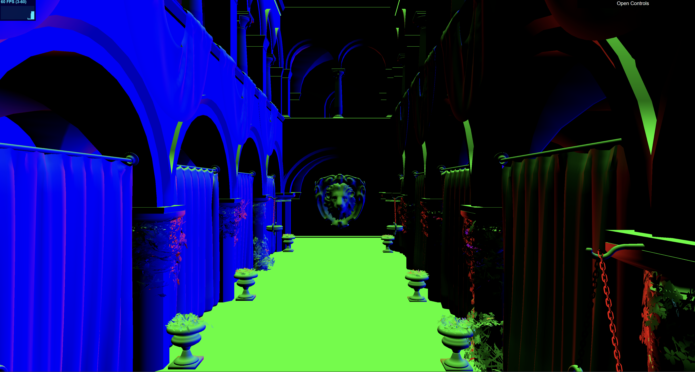
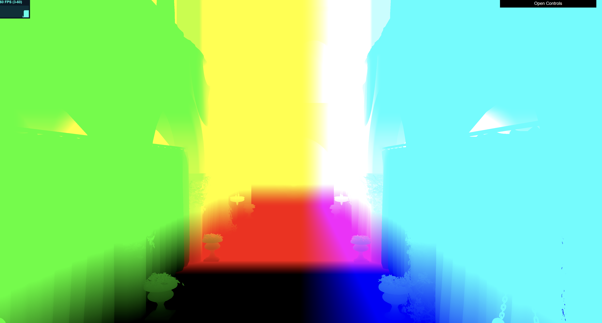
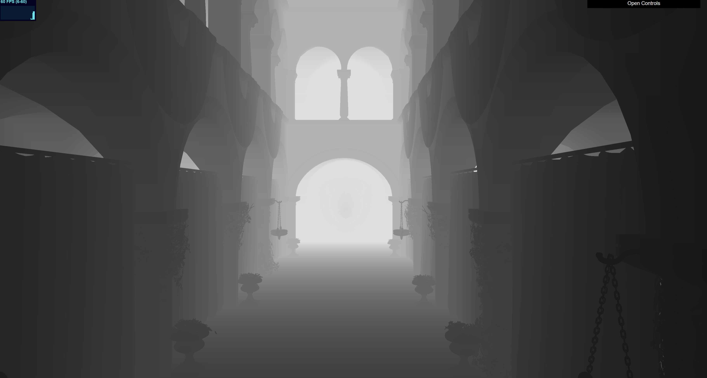

WebGL Forward+ and Clustered Deferred Shading
======================

**University of Pennsylvania, CIS 565: GPU Programming and Architecture, Project 4**

Rachel Lin

* [LinkedIn](https://www.linkedin.com/in/rachel-lin-452834213/)
* [personal website](https://www.artstation.com/rachellin4)
* [Instagram](https://www.instagram.com/lotus_crescent/)

Tested on: Windows 11, 12th Gen Intel(R) Core(TM) i7-12700H @ 2.30GHz, NVIDIA GeForce RTX 3080 Laptop GPU (16 GB)

### Live Demo
https://racheldlin.github.io/Project4-WebGPU-Forward-Plus-and-Clustered-Deferred/

### Demo Video/GIF

### Credits

- [Vite](https://vitejs.dev/)
- [loaders.gl](https://loaders.gl/)
- [dat.GUI](https://github.com/dataarts/dat.gui)
- [stats.js](https://github.com/mrdoob/stats.js)
- [wgpu-matrix](https://github.com/greggman/wgpu-matrix)

# Overview

This web app offers three different rendering pipelines: naive forward, forward+, and clustered deferred. The forward plus and clustered deferred techniques offer additional optimizations that help improve performance beyond naive forward rendering.

## Naive Forward

Naive forward rendering works by looping through each light in the scene for each pixel and summing the light contributions. The program first writes the view projection matrix to a buffer and sends it to the GPU. In the vertex shader, the view projection matrix is used to transform the position from world to screen space. The fragment shader then takes the screen space position and computes the light contribution based on the normal, position, and albedo. Since this method involves iterating through every light for every pixel, using this implementation can get expensive quickly.

## Forward+

Forward+ builds off of naive forward by breaking the screen up into tiles called clusters. Before performing lighting calculations, a compute pass finds and stores the lights that are close enough in distance to the cluster to actually have meaningful lighting contribution. In the lighting pass, the fragment shader then loops through the clusters and only computes contribution from lights within each cluster when calculating the pixel's color. This technique helps avoid expensive lighting calculations for lights that are unnecessary and don't actually contribute to the final render. 

Something to keep in mind with this implementation is that the clusters have a set array size for storing lights. When there are more lights contributing to a cluster than the maximum allowance, these lights are dropped. This can result in artifacting similar to what is shown below when the total number of lights exceeds the maximum number of lights per cluster by too much.

## Clustered Deferred

Clustered deferred rendering takes the concept of clustering and combines it with deferred rendering. In deferred rendering, scene information like normals, albedo, and position is stored in textures called GBuffers. By only writing information for visible geometry, we avoid having overdraw for opaque geometry. However, without a hybrid deferred/forward approach, it is difficult to accurately capture properties like translucency and bounce lighting that require information on geometry that may be hidden or physically behind another object.

| Normal Buffer | Albedo Buffer	| Position Buffer	| Depth Buffer |
| --------- | --------- | --------- | --------- |
|  |  |  |  |

# Performance

## Number of Lights

## Max Number of Lights in a Cluster

## Number of Clusters

## Clustering Workgroup Size

## Light Radius

